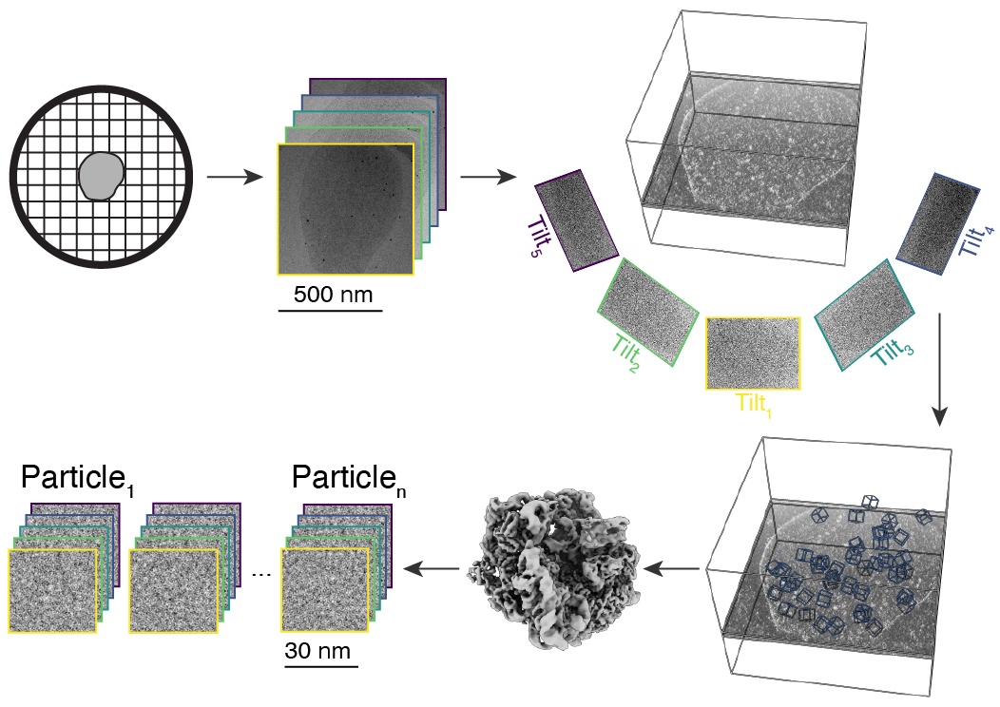
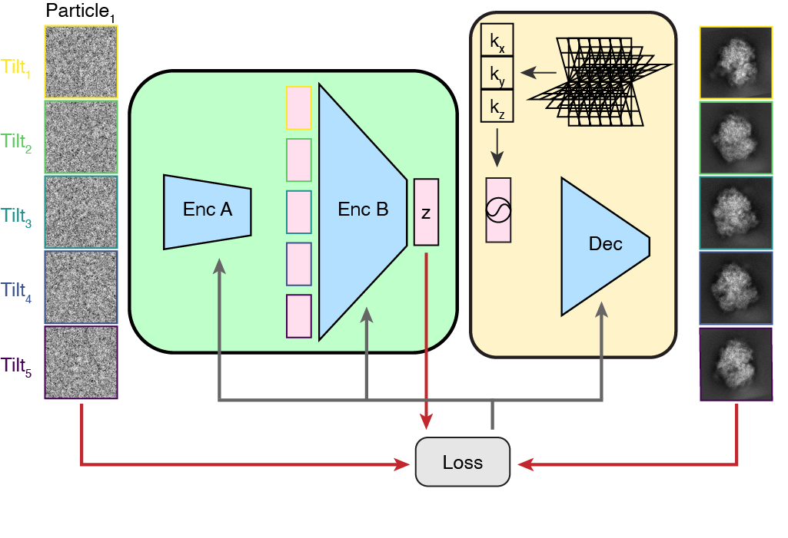
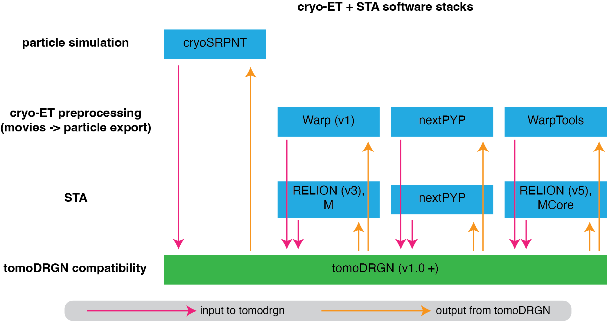

Background
===========

Motivation
-----------

    Overview of the cryo-ET to STA pipeline: (1) the sample is plunge-frozen on a grid, (2) a series of projection images are collected at varying stage tilt angles, (3) the tilt images are aligned and backprojected, (4) all (randomly oriented and noisy) instances of a macromolecule are identified, (5) these instances are aligned and averaged, (6) the underlying 2-D images of each instance are extracted from the input tilt images.

Cryo-electron tomography (cryo-ET) entails repeatedly tilting and imaging a particular region of a frozen biological specimen.
Cryo-ET data have extremely low signal relative to noise, and also require extensive downstream processing for interpretation.
One such downstream processing option is sub-tomogram averaging (STA), which entails aligning and averaging many presumed-homogeneous instances of a macromolecular structure of interest.
STA thereby significantly gains resolution in the average structure, at the expense of losing structurally heterogeneous details of individual macromolecule instances.

TomoDRGN is a tool that aims to learn the unique 3-D structure of each macromolecular instance, given prior knowledge of:

1. the series of 2-D projection images of each instance, and
2. the alignment (pose) and imaging conditions (CTF parameters) of each image of each instance relative to the average.

Implementation
---------------

    Overview of the tomoDRGN model architecture during model training on the multiple 2-D images of a single particle.

TomoDRGN pursues this goal by training a custom variational autoencoder (VAE) model on a particular macromolecular dataset, following upstream particle alignment with STA.
The structure of this VAE first embeds all images of the given macromolecule particle to a unique position (relative to the rest of the dataset) in a continuous, low-dimension (e.g. 8-dimensional) "latent" space.
The VAE then uses this particle's unique latent embedding to decode (i.e., generate) the corresponding 3-D volume consistent with that particle's 2-D projection image data.

TomoDRGN is designed to use all available information (i.e. all tilt images of each particle), while imposing minimal constraints or priors on the learned heterogeneity.
The loss function tomoDRGN optimizes while training on each dataset consists only of a reconstruction loss term (how accurately the decoded particle matches the input images), and a latent space regularization (that the distribution of embeddings in latent space should be approximately normal).
Therefore, tomoDRGN is particularly well suited to simultaneously learning extensive compositional and conformational heterogeneity.
However, it may not be as effective in reconstructing strictly conformational heterogeneity or heterogeneity in a specific sub-region of the particle as other tools that do enforce stronger regularization.

.. _compatible_sta_software:

Compatible upstream STA software
----------------------------------

    Diagram of upstream cryo-ET and STA software stacks that are compatible with the current version of tomoDRGN.

TomoDRGN model training requires as inputs:

1. one (or more) files containing projection images of each particle extracted from each stage tilt micrograph (typically in ``.mrcs`` format), and
2. a corresponding file containing metadata describing pose and CTF parameters for each tilt image of each particle, as derived from upstream subtomogram averaging (typically in ``.star`` format).

The diagram above summarizes the upstream processing workflows that are tested and known to be compatible with tomoDRGN.
Note that in each case, particles should be exported as 2-D image stacks, not as 3-D subtomogram volumes.
In the case of the Warp (v1) to RELION (v3) stack, we recommend making use of the excellent [dynamo2warp](https://github.com/alisterburt/dynamo2m) tools from Alister Burt.

Alternative upstream processing software
-----------------------------------------

RELION v4
***********

May be possible with TeamTomo Warp - RELION v4 - M suite of tools that should enable conversion from RELION v4 STA to Warp/M for subtomogram extraction as imageseries.
https://gist.github.com/biochem-fan/c21b4701cc633201c5c99582b4ca16b3
However, we have not tested this yet.

RELION v5
**********
While we have not yet tested a fully RELION v5 processing pipeline as input to tomoDRGN, WarpTools compatibility with RELION v5 for STA suggests that this may work.
However, the tomogram coordinate system (and associated tomogram geometry star file headers) may need to be translated to the format used in WarpTools.

CisTEM
*******

CisTEM can extract images from tilt series, as required for tomoDRGN.
Support for cisTEM star files with tomoDRGN is mostly complete but minimally tested.
This approach should also enable emClarity-processed subtomograms to be extracted in cisTEM through existing emClarity - cisTEM pipelines.

Others
********

Cryo-ET is an exciting, rapidly developing field with many distinct software tools.
We do not yet support import from other software packages (e.g. STOPGAP, PyTOM, ...).
If your workflow uses other software packages, and this metadata cannot be converted into one of the supported subtomogram extraction pipelines described above, please reach out to us with your use case.

Additional details about required metadata
-------------------------------------------

TomoDRGN requires several specific metadata headers and values to be supplied in the input star file.
The names and formats of this metadata vary by upstream processing software stack, but generally include:

* the path to each image on disk (e.g. ``rlnImageName``)
* the Euler angles of each image relative to the consensus reconstruction (e.g. ``rlnAngleRot``, ``rlnAngleTilt``, ``rlnAnglePsi``)
* the translations of each image relative to the consensus reconstruction (e.g. ``rlnOriginX``, ``rlnOriginY``)
* the CTF parameters of each image (e.g. ``rlnImagePixelSize``, ``rlnDefocusU``, ``rlnDefocusV``, ``rlnDefocusAngle``, ``rlnVoltage``, ``rlnSphericalAberration``, `rlnAmplitudeContrast``, ``rlnPhaseShift``)
* the stage tilt and cumulative dose at each image (e.g. ``rlnCtfScalefactor``, ``rlnCtfBfactor``)
* a unique identifier for all images of a single particle (e.g. ``rlnGroupName``, only relevant for "image series" format star files exported by Warp v1 and NextPYP)
* a unique identifier for all particles in a given tomogram (e.g. ``rlnTomoName``)
* tomoDRGN ignores but maintains all other headers, allowing interactive post-training analysis to probe per-particle correlations with other user-defined metadata

Sample star files are provided in the github repository at ``tomodrgn/testing/data/10076_both_32_sim.star`` (cryoSRPNT format), and ``tomodrgn/testing/data/warptools_test_4-tomos_10-ptcls_box-32_angpix-12*.star`` (WarpTools format).
